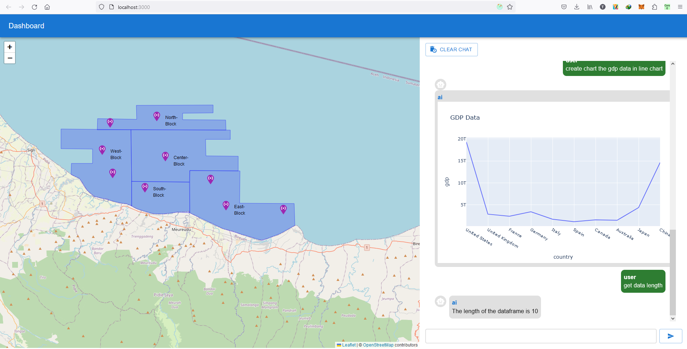

# REACT MAP - PANDAS-AI

## How to install
1. Set *pandas-ai chat server* at **config.js**
2. Run UI : *npm run start*
3. Build for production : *npm run build*

## Demo:

scp -r -P 23 build/* waviv@117.54.250.85:/var/www/html/backend.knowai.app
scp -r -P 24 build/* reska@117.54.250.82:/var/www/html/survei